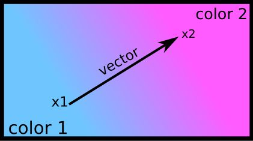

.. _gradients:

=================================
Gradient Effects
=================================

Gradients effects are extremely useful, for instance to make custom masks.
In most graphical softwares, if you point two positions ``x1`` and ``x2``
on the screen and choose two colors, you obtain a nice
color gradient like this: 

Here is an efficient implementation of the gradient ::
    
	def gradient(size,c1,c2,col1=0,col2=1.0):
		"""
		size : size of the final picture
		c1 : (x,y) of the border point of col1
		c2 : (x,y) of the border point of col2
		col1, col2: can be floats to create gradient masks, or
				    RGB arrays to create gradient images.
		"""
		
		c1, c2, col1, col2 = map(np.array,
				[c1[::-1], c2[::-1], col1, col2])
		vector = c2 - c1
		norm = np.linalg.norm(vector)
		n_vec = vector/norm**2
		M = np.meshgrid(range(size[1]),range(size[0]))
		arr = (dstack(M)-c1).dot(n_vec)
		arr = np.minimum(1,np.maximum(0,arr))
		return (col2*arr + col1- col1*arr).T

And while we are at it, here is the code for a bilateral gradient: ::
    
    def biGradient(size,c1,vector,col1=0,col2=1.0):
        """ Returns a picture of size `res` where the pixel
            at position `center` is of color `col1` and the color
            is fading is fading to `col2` in the direction of
            `vector` AND the opposite direction """
        c1, vector = map(np.array,[c1,vector]) 
        l1 =  gradient(size,c1,c1+vector,col1,col2)
        l2 =  gradient(size,c1,c1-vector,col1,col2)
        return np.minimum(l1,l2)

