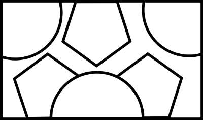

======================================
Placing clips according to a picture
======================================

So how do you do some complex compositing like this ?

.. raw:: html

        
<iframe type="text/html" src="https://www.youtube.com/embed/1hdgNxX-tas" frameborder="0" style="position: absolute; top: 0; bottom: 10; width: 90%; height: 100%;" allowfullscreen></iframe>

It takes a lot of bad taste, and a segmenting tool

In this script we will use this image (generated with Inkscape):

We will find the regions of this image and fit the different clips into these regions:

.. literalinclude:: ../../examples/compo_from_image.py

(note that some pictures are distorted here as their size has been modified without care for their aspect ratio. This could be changed with a few more lines.)
