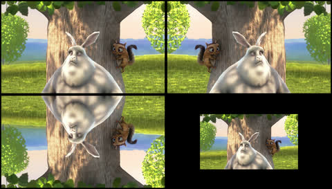
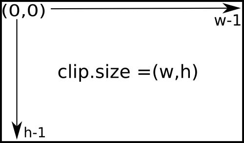

.. _CompositeVideoClips:

Mixing clips
=============

Video composition, also known as non-linear editing, is the fact of playing several clips together in a new clip. This video is a good example of what compositing you can do with MoviePy:

.. raw:: html

        

        <iframe type="text/html" src="https://youtube.com/embed/rIehsqqYFEM?rel=0" frameborder="0"
        style="position: absolute; top: 0; bottom: 10; width: 70%; height: 100%; ">
        </iframe>
        

Before starting, note that video clips generally carry an audio track and a mask, which are also clips. When you compose these clips together, the soundtrack and mask of the final clip are automatically generated by putting together the soundtracks and masks of the clips. So most of the time you don't need to worry about mixing the audio and masks.

Stacking and concatenating clips
~~~~~~~~~~~~~~~~~~~~~~~~~~~~~~~~~

Two simple ways of putting clips together is to concatenate them (to play them one after the other in a single long clip) or to stack them (to them side by side in a single larger clip).

Concatenation is done with the function ``concatenate_videoclips``: ::

    from moviepy.editor import VideoFileClip, concatenate_videoclips
    clip1 = VideoFileClip("myvideo.mp4")
    clip2 = VideoFileClip("myvideo2.mp4").subclip(50,60)
    clip3 = VideoFileClip("myvideo3.mp4")
    final_clip = concatenate_videoclips([clip1,clip2,clip3])
    final_clip.write_videofile("my_concatenation.mp4")

The ``final_clip`` is a clip that plays the clips 1, 2, and 3 one after the other. Note that the clips do not need to be the same size. If they arent's they will all appear centered in a clip large enough to contain the biggest of them, with optionnally a color of your choosing to fill the borders. You have many other options there (see the doc of the function). You can for instance play a transition clip between the clips with the option ``transition=my_clip``.

Stacking is done with ``clip_array``: ::

    from moviepy.editor import VideoFileClip, clips_array, vfx
    clip1 = VideoFileClip("myvideo.mp4").margin(10) # add 10px contour
    clip2 = clip1.fx( vfx.mirror_x)
    clip3 = clip1.fx( vfx.mirror_y)
    clip4 = clip1.resize(0.60) # downsize 60%
    final_clip = clips_array([[clip1, clip2],
                              [clip3, clip4]])
    final_clip.resize(width=480).write_videofile("my_stack.mp4")

You obtain a clip which looks like this:

CompositeVideoClips
~~~~~~~~~~~~~~~~~~~~~

The `CompositeVideoClip` class provides a very flexible way to compose clips, but is more complex than ``concatenate_videoclips`` and ``clips_array`` ::

    video = CompositeVideoClip([clip1,clip2,clip3])

Now ``video`` plays ``clip1``, and ``clip2`` *on top of* ``clip1``, and ``clip3`` on top of ``clip1``, and ``clip2``. For instance, if ``clip2`` and ``clip3`` have the same size as ``clip1``, then only ``clip3``, which is on top, will be visible in the video... unless  ``clip3`` and ``clip2`` have masks which hide parts of them. Note that by default the composition has the size of its first clip (as it is generally a *background*). But sometimes you will want to make your clips *float* in a bigger composition, so you will specify the size of the final composition as follows ::

    video = CompositeVideoClip([clip1,clip2,clip3], size=(720,460))

Starting and stopping times
""""""""""""""""""""""""""""

In a CompositionClip, all the clips start to play at a time that is specified by the ``clip.start`` attribute. You can set this starting time as follows: ::

    clip1 = clip1.set_start(5) # start after 5 seconds

So for instance your composition will look like ::

    video = CompositeVideoClip([clip1, # starts at t=0
                                clip2.set_start(5), # start at t=5s
                                clip3.set_start(9)]) # start at t=9s

In the example above, maybe ``clip2`` will start before ``clip1`` is over. In this case you can make ``clip2`` appear with a *fade-in* effect of one second: ::

    video = CompositeVideoClip([clip1, # starts at t=0
                                clip2.set_start(5).crossfadein(1),
                                clip3.set_start(9).crossfadein(1.5)])

Positioning clips
""""""""""""""""""

If ``clip2`` and ``clip3`` are smaller than ``clip1``, you can decide where they will appear in the composition by setting their position. Here we indicate the coordinates of the top-left pixel of the clips: ::

    video = CompositeVideoClip([clip1,
                               clip2.set_position((45,150)),
                               clip3.set_position((90,100))])

There are many ways to specify the position: ::

    clip2.set_position((45,150)) # x=45, y=150 , in pixels

    clip2.set_position("center") # automatically centered

    # clip2 is horizontally centered, and at the top of the picture
    clip2.set_position(("center","top"))

    # clip2 is vertically centered, at the left of the picture
    clip2.set_position(("left","center"))

    # clip2 is at 40% of the width, 70% of the height of the screen:
    clip2.set_position((0.4,0.7), relative=True)

    # clip2's position is horizontally centered, and moving down !
    clip2.set_position(lambda t: ('center', 50+t) )

When indicating the position keep in mind that the ``y`` coordinate has its zero at the top of the picture:

.. Transitions
.. ------------

.. Everyone loves transitions between clips: fade-ins, fade-out, clips that slide in front of the previous one... everything is good to impress your grandparents.

.. In MoviePy, transitions are effects (see :ref:`effects`_) from the module moviepy.video.compositing.

Compositing audio clips
-------------------------

When you mix video clips together, MoviePy will automatically compose their respective audio tracks to form the audio track of the final clip, so you don't need to worry about compositing these tracks yourself.

If you want to make a custom audiotrack from several audio sources: audioc clips can be mixed together with ``CompositeAudioClip`` and ``concatenate_audioclips``: ::

    from moviepy.editor import *
    # ... make some audio clips aclip1, aclip2, aclip3
    concat = concatenate_audioclips([aclip1, aclip2, aclip3])
    compo = CompositeAudioClip([aclip1.volumex(1.2),
                                aclip2.set_start(5), # start at t=5s
                                aclip3.set_start(9)])

