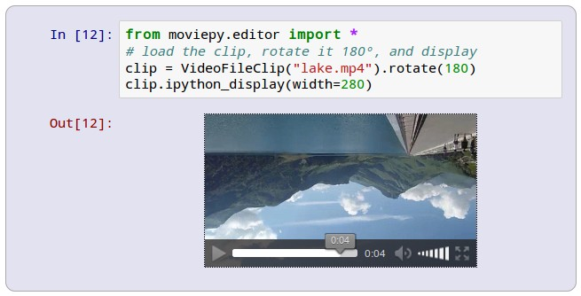

.. _efficient:

How to be efficient with MoviePy
================================

This section gathers tips and tricks to help you make the most of what is already known worldwide as *the MoviePy experience*. 

The best way to start with MoviePy is to use it with the IPython Notebook: it makes it easier to preview clips (as we will see in this section), has autocompletion, and can display the documentation for the different methods of the library.

.. _should_i_use_moviepy_editor:

Should I use ``moviepy.editor``?
~~~~~~~~~~~~~~~~~~~~~~~~~~~~~~~~~~

Older versions of MoviePy always recommended importing from ``moviepy.editor``. In v2.0 and above this is no longer recommended and you should generally import directly from ``moviepy`` (for example, ``from moviepy import VideoFileClip``).
The module ``moviepy.editor`` should now only be loaded if you are using MoviePy to edit videos *by hand*. Importing it will:
- Start a pygame session to enable ``clip.show()`` and ``clip.preview()`` if pygame is installed
- Enable ``clip.ipython_display()`` if in an IPython Notebook
- Enable ``sliders()`` if Matplotlib is installed

.. _previewing:

When to close() a clip
~~~~~~~~~~~~~~~~~~~~~~

When you create some types of clip instances - e.g. ``VideoFileClip`` or ``AudioFileClip`` - MoviePy creates a subprocess and locks the file. In order to release those resources when you are finished you should call the ``close()`` method.

This is more important for more complex applications and is particularly important when running on Windows. While Python's garbage collector should eventually clean up the resources for you, closing them makes them available earlier.

However, if you close a clip too early, methods on the clip (and any clips derived from it) become unsafe.

So, the rules of thumb are:

    * Call ``close()`` on any clip that you **construct** once you have finished using it and have also finished using any clip that was derived from it.
    * Even if you close a ``CompositeVideoClip`` instance, you still need to close the clips it was created from.
    * Otherwise, if you have a clip that was created by deriving it from from another clip (e.g. by calling ``with_mask()``), then generally you shouldn't close it. Closing the original clip will also close the copy.

Clips act as `context managers <https://docs.python.org/3/reference/datamodel.html#context-managers>`_. This means you
can use them with a ``with`` statement, and they will automatically be closed at the end of the block, even if there is
an exception. ::

    with AudioFileClip("song.wav") as clip:
        raise NotImplementedError("I will work out how process this song later")
    # clip.close() is implicitly called, so the lock on song.wav file is immediately released.

The many ways of previewing a clip
~~~~~~~~~~~~~~~~~~~~~~~~~~~~~~~~~~~

When you are editing a video or trying to achieve an effect with MoviePy through a trial and error process, generating the video at each trial can be very long. This section presents a few tricks to go faster.

clip.save_frame
"""""""""""""""""

Most of the time, just having one frame of the video can tell you if you are doing the right thing. You can save just one frame of the clip to a file as follows: ::
    
    my_clip.save_frame("frame.jpeg") # saves the first frame
    my_clip.save_frame("frame.png", t=2) # saves the frame a t=2s

.. _clip_preview:

clip.show and clip.preview
""""""""""""""""""""""""""""

The methods ``clip.show`` and ``clip.preview`` enable you to visualise the clip in a Pygame window. They are the fastest way to preview, as the clips are generated and displayed at the same time, and they can be useful to get the coordinates or colors of pixels. These methods require to have PyGame installed, and to use the ``moviepy.editor`` module.

The method ``clip.show`` enables preview one frame of a clip without having to write it to a file: the following lines display the frame in a PyGame window ::
    
    my_clip.show() # shows the first frame of the clip
    my_clip.show(10.5) # shows the frame of the clip at t=10.5s
    my_clip.show(10.5, interactive = True)

The last line (with ``interactive=True``) displays the frame in an interactive way: if you click somewhere in the frame, it will print the position and color of the pixel. Press Escape to exit when you are done.

A clip can be previewed as follows ::
    
    my_clip.preview() # preview with default fps=15
    my_clip.preview(fps=25)
    my_clip.preview(fps=15, audio=False) # don't generate/play the audio.
    my_audio_clip.preview(fps=22000)

If you click somewhere in the frames of a video clip being previewed, it will print the position and color of the pixel clicked. Press Escape abort the previewing.

Note that if the clip is complex and your computer not fast enough, the preview will appear slowed down compared to the real speed of the clip. In this case you can try to lower the frame rate (for instance to 10) or reduce the size of the clip with ``clip.resize``, it helps.

.. _ipython_display:

ipython_display
""""""""""""""""

Displaying the clips in a IPython Notebook can be very practical, especially if don't want to use ``clip.show()`` and ``clip.preview()``. Here is what it will look like:

With ``ipython_display`` you can embed videos, images and sounds, either from a file or directly from a clip: ::
    
    ipython_display(my_video_clip) # embeds a video
    ipython_display(my_imageclip) # embeds an image
    ipython_display(my_audio_clip) # embeds a sound
    
    ipython_display("my_picture.jpeg") # embeds an image
    ipython_display("my_video.mp4") # embeds a video
    ipython_display("my_sound.mp3") # embeds a sound

This will only work if ``ipython_display`` is on the last line a the notebook cell. You can also call ``ipython_display`` as a clip method: ::

    my_video_clip.ipython_display()

If the rendering of your clip requires to provide a frame rate, you can specify ``fps=25`` in ``ipython_display``.

If you only need to display a snapshot of a video clip at some time `t` you can write ::

    my_video_clip.ipython_display(t=15) # will display a snapshot at t=15s

You can also provide any valid HTML5 option as keyword argument. For instance, if the clip is too big, you will write ::
    
    ipython_display(my_clip, width=400) # HTML5 will resize to 400 pixels

For instance, when you are editing an animated GIF and want to check that it loops well, you can ask the video to start automatically and to loop (i.e. replay indefinitely) : ::
    
    ipython_display(my_clip, autoplay=1, loop=1)

Importantly, ``ipython_display`` actually embeds the clips physically in your notebook. The advantage is that you can move the notebook or put it online and the videos will work. The drawback is that the file size of the notebook can become very large. Depending on your browser, re-computing and displaying at video many times can take some place in the cache and the RAM (it will only be a problem for intensive uses). Restarting your browser solves the problem.
